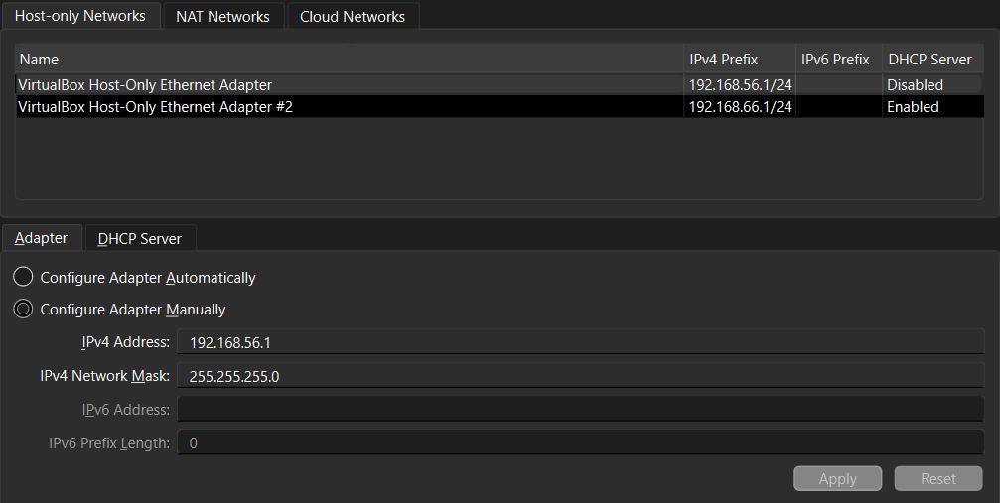
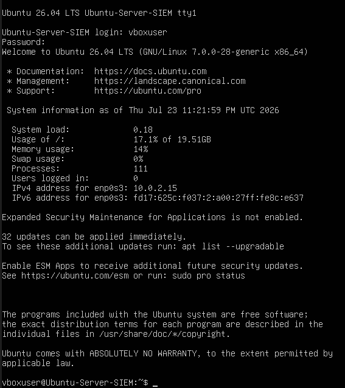
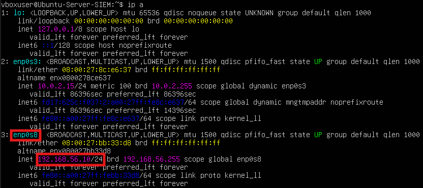
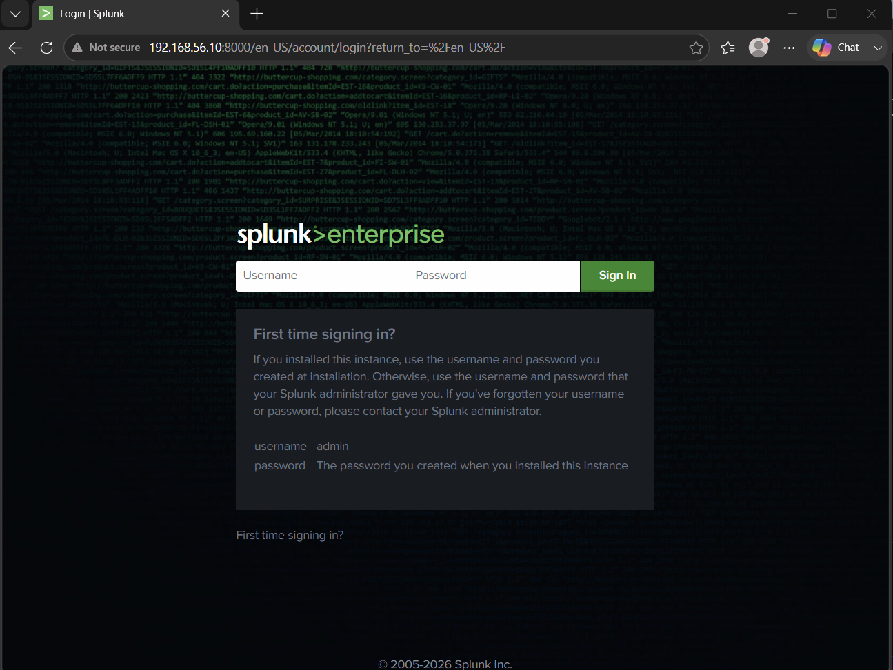
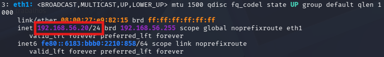
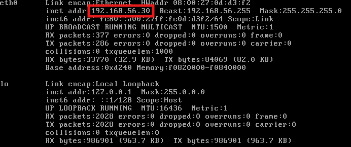
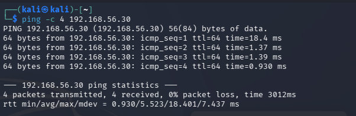
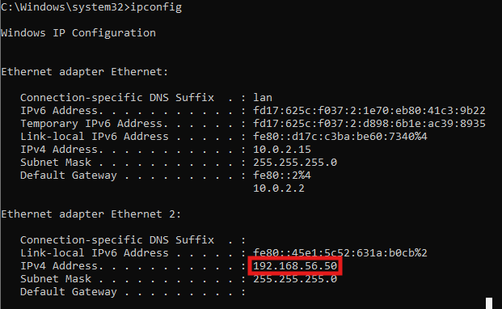
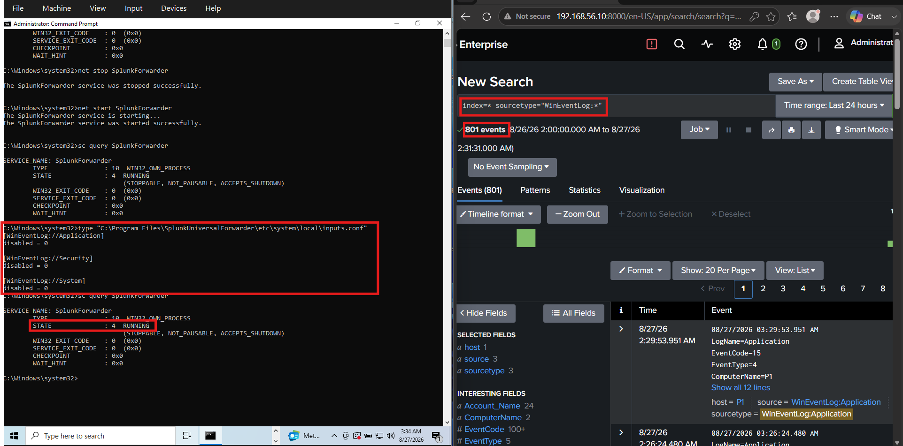

# Setup Notes

## Network Configuration
- Rede escolhida: VirtualBox Host-Only Ethernet Adapter
- Range de IP: 192.168.56.0/24
- DHCP Server: desativado (IPs atribuídos manualmente a cada VM)

A configuração padrão das VMs utiliza 2 adaptadores de rede:

- Adapter 1: NAT (acesso à internet, para updates e downloads)
- Adapter 2: Host-only (192.168.56.0/24) — comunicação entre VMs e simulação de ataques

Exceção: o Metasploitable2 utiliza apenas o adaptador Host-only, mantendo a máquina vulnerável isolada da Internet.

## Ubuntu Server SIEM — Installation
- VM criada: Ubuntu-Server-SIEM
- Ubuntu 26.04 LTS
- RAM: 2048 MB | CPUs: 2 | Disco: 20GB
- Guest Additions: não instaladas (script de instalação automática falhou com erro em vboxpostinstall.sh; reinstalação sem essa opção resolveu)
- Rede: Adapter 1 (NAT) + Adapter 2 (Host-only, 192.168.56.0/24)
- Login confirmado com sucesso, IP atribuído via NAT: 10.0.2.15 (Adapter 1)

## Static IP Configuration (Host-only Interface)
- Interface configurada: enp0s8
- IP fixo atribuído: 192.168.56.10/24
- Configuração feita via Netplan (/etc/netplan/50-cloud-init.yaml)
- Permissões do ficheiro netplan ajustadas com `chmod 600` (recomendação do próprio Netplan, ficheiro não deve ser acessível por outros)
- Convenção de IPs definida para o lab: .10 = Ubuntu Server (SIEM), .20 = Kali, .30 = Metasploitable2, .50 = Windows 10

## Splunk Installation
- Acesso remoto à VM configurado via SSH, para facilitar transferência de ficheiros e gestão do sistema
- Ficheiro .deb transferido do host para a VM via SCP
- Instalado com: sudo dpkg -i splunk-10.4.1-5a009d941268-linux-amd64.deb
- Criado utilizador dedicado `siem` para correr o Splunk (evitar correr como root)
- Splunk iniciado a partir do utilizador siem
- Interface web acessível via http://192.168.56.10:8000 (rede host-only), acesso confirmado via browser

## Kali Linux — Installation & Network Configuration
- VM importada a partir da imagem oficial pré-construída (kali-linux-2026.2-virtualbox-amd64)
- RAM: 2048–4096 MB | CPUs: 2
- Rede: Adapter 1 (NAT) + Adapter 2 (Host-only, 192.168.56.0/24)
- Kali não usa Netplan (diferente do Ubuntu Server) — configuração de rede feita via NetworkManager (nmcli)
- IP fixo atribuído: 192.168.56.20/24, interface eth1 ("Wired connection 2")

## Metasploitable2 — Installation & Network Configuration

- VM: Metasploitable2
- Função: alvo vulnerável principal do laboratório
- Adapter 1: desativado
- Adapter 2: Host-only (192.168.56.0/24)
- Interface de rede: eth0
- IP fixo atribuído: 192.168.56.30/24
- Configuração feita através de `/etc/network/interfaces`
- A VM foi mantida sem acesso à Internet para permanecer isolada da rede externa
- Comunicação com o Kali Linux confirmada através de ICMP (ping), com 0% packet loss

### Connectivity Test — Kali to Metasploitable2

Após configurar o IP estático do Metasploitable2, foi realizado um teste de conectividade entre o Kali Linux (máquina atacante) e o Metasploitable2 (máquina alvo) através de ICMP.

Comando executado no Kali Linux:

`ping -c 4 192.168.56.30`

Resultado:
- 4 packets transmitted
- 4 packets received
- 0% packet loss

O teste confirmou que o Kali Linux (`192.168.56.20`) consegue comunicar corretamente com o Metasploitable2 (`192.168.56.30`) através da rede isolada **Host-only**.

## Windows 10 — Installation & Network Configuration

- VM criada: Windows-10-Lab
- Sistema operativo: Windows 10
- RAM: 4096 MB | CPUs: 2 | Disco: 50 GB
- Rede: Adapter 1 (NAT) + Adapter 2 (Host-only, 192.168.56.0/24)
- IP fixo atribuído: 192.168.56.50/24
- IP configurado manualmente na interface Ethernet 2
- Adapter 1 (NAT): 10.0.2.15
- Adapter 2 (Host-only): 192.168.56.50/24

## Windows 10 — Splunk Universal Forwarder

- Splunk Universal Forwarder instalado no Windows 10
- Receiving Indexer configurado para `192.168.56.10:9997`
- Serviço `SplunkForwarder` confirmado em estado `RUNNING`
- Ficheiro `inputs.conf` criado em:
  `C:\Program Files\SplunkUniversalForwarder\etc\system\local\inputs.conf`
- Windows Event Logs configurados para recolha:
  - Application
  - Security
  - System
- Comunicação com o Splunk Enterprise confirmada
- Eventos Windows recebidos com sucesso no Splunk Web através da pesquisa:
  `index=* sourcetype="WinEventLog:*"`

