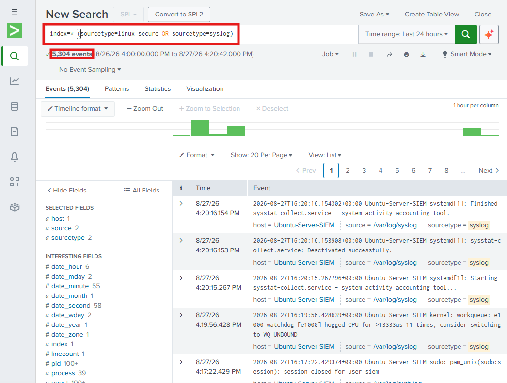
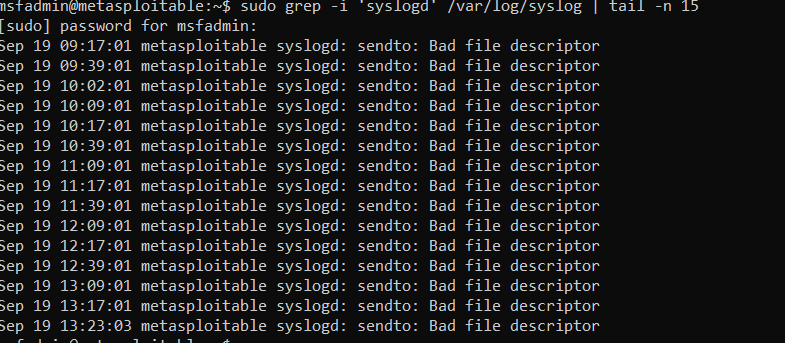
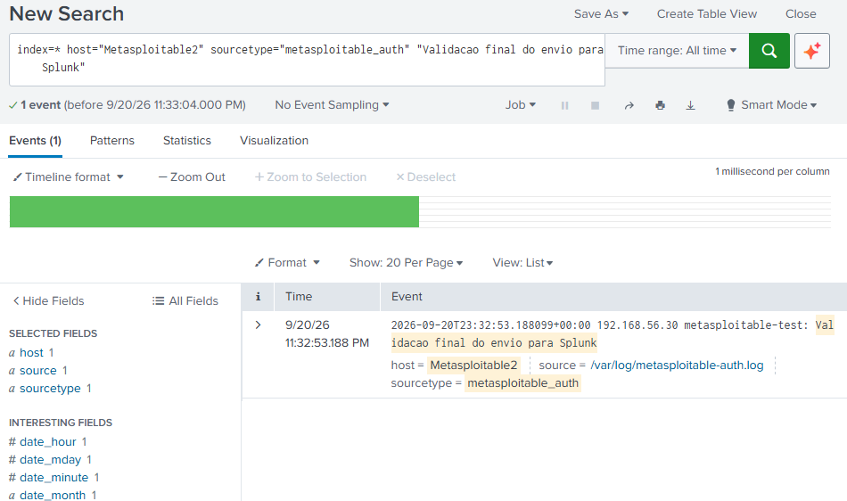
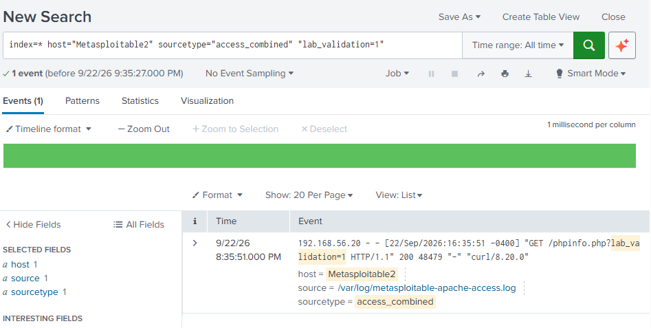
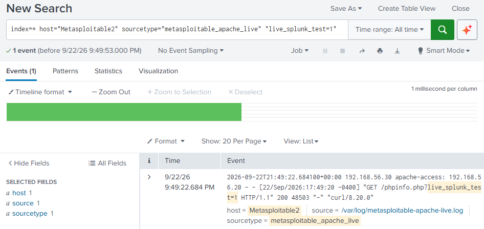
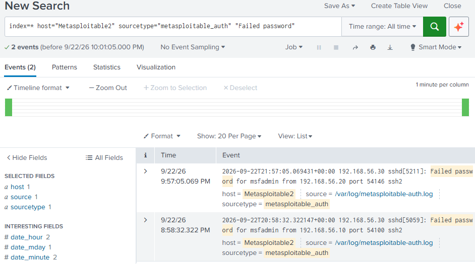

# Setup Notes

## Network Configuration
- Rede escolhida: VirtualBox Host-Only Ethernet Adapter
- Range de IP: 192.168.56.0/24
- DHCP Server: desativado (IPs atribuídos manualmente a cada VM)

A configuração padrão das VMs utiliza 2 adaptadores de rede:

- Adapter 1: NAT (acesso à internet, para updates e downloads)
- Adapter 2: Host-only (192.168.56.0/24) — comunicação entre VMs e simulação de ataques

Exceção: o Metasploitable2 utiliza apenas o adaptador Host-only, mantendo a máquina vulnerável isolada da Internet.

## Ubuntu Server SIEM — Installation
- VM criada: Ubuntu-Server-SIEM
- Ubuntu 26.04 LTS
- RAM: 2048 MB | CPUs: 2 | Disco: 20GB
- Guest Additions: não instaladas (script de instalação automática falhou com erro em vboxpostinstall.sh; reinstalação sem essa opção resolveu)
- Rede: Adapter 1 (NAT) + Adapter 2 (Host-only, 192.168.56.0/24)
- Login confirmado com sucesso, IP atribuído via NAT: 10.0.2.15 (Adapter 1)

## Static IP Configuration (Host-only Interface)
- Interface configurada: enp0s8
- IP fixo atribuído: 192.168.56.10/24
- Configuração feita via Netplan (/etc/netplan/50-cloud-init.yaml)
- Permissões do ficheiro netplan ajustadas com `chmod 600` (recomendação do próprio Netplan, ficheiro não deve ser acessível por outros)
- Convenção de IPs definida para o lab: .10 = Ubuntu Server (SIEM), .20 = Kali, .30 = Metasploitable2, .50 = Windows 10

## Splunk Installation
- Acesso remoto à VM configurado via SSH, para facilitar transferência de ficheiros e gestão do sistema
- Ficheiro .deb transferido do host para a VM via SCP
- Instalado com: sudo dpkg -i splunk-10.4.1-5a009d941268-linux-amd64.deb
- Criado utilizador dedicado `siem` para correr o Splunk (evitar correr como root)
- Splunk iniciado a partir do utilizador siem
- Interface web acessível via http://192.168.56.10:8000 (rede host-only), acesso confirmado via browser

## Kali Linux — Installation & Network Configuration
- VM importada a partir da imagem oficial pré-construída (kali-linux-2026.2-virtualbox-amd64)
- RAM: 2048–4096 MB | CPUs: 2
- Rede: Adapter 1 (NAT) + Adapter 2 (Host-only, 192.168.56.0/24)
- Kali não usa Netplan (diferente do Ubuntu Server) — configuração de rede feita via NetworkManager (nmcli)
- IP fixo atribuído: 192.168.56.20/24, interface eth1 ("Wired connection 2")

## Metasploitable2 — Installation & Network Configuration

- VM: Metasploitable2
- Função: alvo vulnerável principal do laboratório
- Adapter 1: desativado
- Adapter 2: Host-only (192.168.56.0/24)
- Interface de rede: eth0
- IP fixo atribuído: 192.168.56.30/24
- Configuração feita através de `/etc/network/interfaces`
- A VM foi mantida sem acesso à Internet para permanecer isolada da rede externa
- Comunicação com o Kali Linux confirmada através de ICMP (ping), com 0% packet loss

### Connectivity Test — Kali to Metasploitable2

Após configurar o IP estático do Metasploitable2, foi realizado um teste de conectividade entre o Kali Linux (máquina atacante) e o Metasploitable2 (máquina alvo) através de ICMP.

Comando executado no Kali Linux:

`ping -c 4 192.168.56.30`

Resultado:
- 4 packets transmitted
- 4 packets received
- 0% packet loss

O teste confirmou que o Kali Linux (`192.168.56.20`) consegue comunicar corretamente com o Metasploitable2 (`192.168.56.30`) através da rede isolada **Host-only**.

## Windows 10 — Installation & Network Configuration

- VM criada: Windows-10-Lab
- Sistema operativo: Windows 10
- RAM: 4096 MB | CPUs: 2 | Disco: 50 GB
- Rede: Adapter 1 (NAT) + Adapter 2 (Host-only, 192.168.56.0/24)
- IP fixo atribuído: 192.168.56.50/24
- IP configurado manualmente na interface Ethernet 2
- Adapter 1 (NAT): 10.0.2.15
- Adapter 2 (Host-only): 192.168.56.50/24

## Windows 10 — Splunk Universal Forwarder

- Splunk Universal Forwarder instalado no Windows 10
- Receiving Indexer configurado para `192.168.56.10:9997`
- Splunk Enterprise configurado para receber dados de forwarders na porta TCP `9997`
- Serviço `SplunkForwarder` confirmado em estado `RUNNING`
- Ficheiro `inputs.conf` criado em:
  `C:\Program Files\SplunkUniversalForwarder\etc\system\local\inputs.conf`
- Windows Event Logs configurados para recolha:
  - Application
  - Security
  - System
- Comunicação com o Splunk Enterprise confirmada
- Eventos Windows recebidos com sucesso no Splunk Web através da pesquisa:
  `index=* sourcetype="WinEventLog:*"`

## Linux Log Ingestion — Splunk

- Utilizador `siem` adicionado ao grupo `adm` para permitir leitura dos logs do sistema
- Splunk configurado para monitorizar `/var/log/auth.log` e `/var/log/syslog`
- `/var/log/auth.log` configurado com sourcetype `linux_secure`
- `/var/log/syslog` configurado com sourcetype `syslog`
- Ingestão dos logs Linux confirmada com sucesso no Splunk Web

### Encaminhamento de Logs do Metasploitable2 — Resolução de Problemas

Durante a reconnaissance, o Splunk já recolhia logs do Ubuntu Server e do Windows, mas ainda não estava a receber os logs de autenticação do Metasploitable2.

Antes de iniciar o cenário de ataque SSH, decidi resolver esta falha para conseguir analisar as tentativas de autenticação no SIEM.

#### Problema encontrado

Configurei o Metasploitable2 para enviar os logs de autenticação para o Ubuntu Server (`192.168.56.10`) através de syslog, na porta UDP 514.

Apesar de o evento de teste aparecer no `/var/log/auth.log` do Metasploitable2, não chegava ao Ubuntu Server. Ao analisar os logs do serviço, encontrei repetidamente o erro:

`syslogd: sendto: Bad file descriptor`

#### Resolução

Reiniciei o serviço de logs do Metasploitable2 com:

`sudo /etc/init.d/sysklogd restart`

Depois do reinício, gerei um novo evento de teste e confirmei que este já chegava ao Ubuntu Server.

Configurei o `rsyslog` para guardar os eventos de autenticação recebidos num ficheiro separado:

`/var/log/metasploitable-auth.log`

Por fim, configurei o Splunk para monitorizar esse ficheiro com os seguintes campos:

- **Host:** `Metasploitable2`
- **Sourcetype:** `metasploitable_auth`

#### Validação final

Gerei outro evento de teste no Metasploitable2 e pesquisei-o no Splunk. O evento apareceu corretamente, confirmando o funcionamento do encaminhamento e da ingestão dos logs.

**Limitação:** A recolha de logs do Metasploitable2 só ficou operacional depois da reconnaissance inicial. Por isso, não tenho os eventos anteriores registados através desta fonte no Splunk.

**O que aprendi:** Antes de simular ataques, devo validar se o SIEM está a receber os logs necessários do alvo. Também aprendi a diagnosticar um problema de encaminhamento, verificando os eventos locais, o serviço de logs e a chegada dos eventos ao servidor de monitorização.
### Apache HTTP Logs — Splunk Integration

Configurei a recolha dos logs HTTP do Metasploitable2 para conseguir analisar no Splunk os pedidos realizados pelo Kali.

#### Historical Logs

Copiei o ficheiro `/var/log/apache2/access.log` do Metasploitable2 para o Ubuntu Server e configurei o Splunk para importar os registos existentes.

Validei a ingestão ao encontrar no Splunk um pedido anterior do Kali à página `/phpinfo.php`.

#### Live Log Forwarding

Configurei o Apache para manter o `access.log` original e enviar os novos pedidos HTTP para o syslog através da facility `local6`.

No Ubuntu Server, o `rsyslog` recebe esses eventos através da porta UDP `514` e guarda-os em:

`/var/log/metasploitable-apache-live.log`

Configurei o Splunk para monitorizar esse ficheiro com:

- **Host:** `Metasploitable2`
- **Sourcetype:** `metasploitable_apache_live`

#### Validation

Executei um novo pedido HTTP no Kali:

`curl -s -o /dev/null -w 'HTTP %{http_code}\n' 'http://192.168.56.30/phpinfo.php?live_splunk_test=1'`

O pedido devolveu `HTTP 200` e apareceu no Splunk, confirmando o funcionamento da recolha contínua.

**Resultado:** O Splunk consegue analisar os registos HTTP antigos importados e receber novos pedidos do Kali automaticamente.
### SSH Logging Validation

Antes de iniciar o primeiro cenário de exploitation, realizei uma tentativa de autenticação SSH falhada a partir do Kali (`192.168.56.20`) contra o Metasploitable2 (`192.168.56.30`).

Confirmei no Splunk que o evento `Failed password` foi recebido através do sourcetype `metasploitable_auth`.

Esta validação permitiu confirmar que o SIEM estava preparado para monitorizar as tentativas de autenticação SSH antes da execução do ataque com Medusa.

