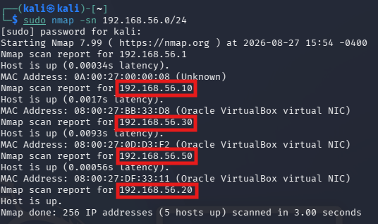
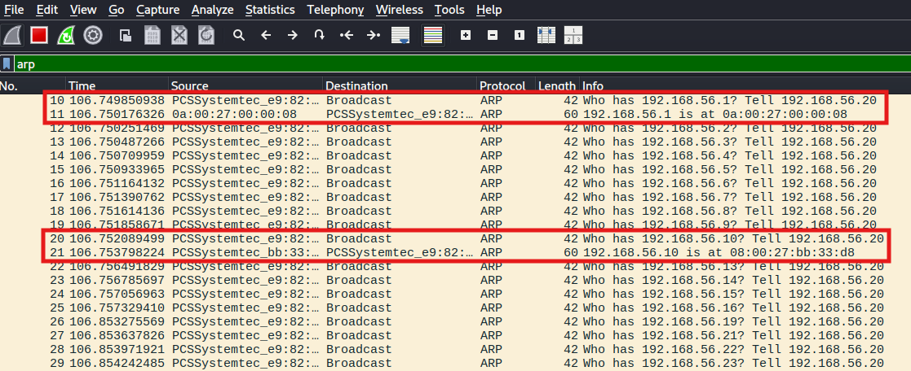
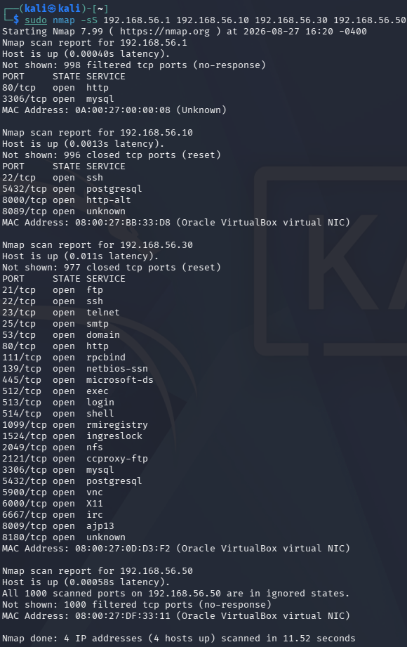
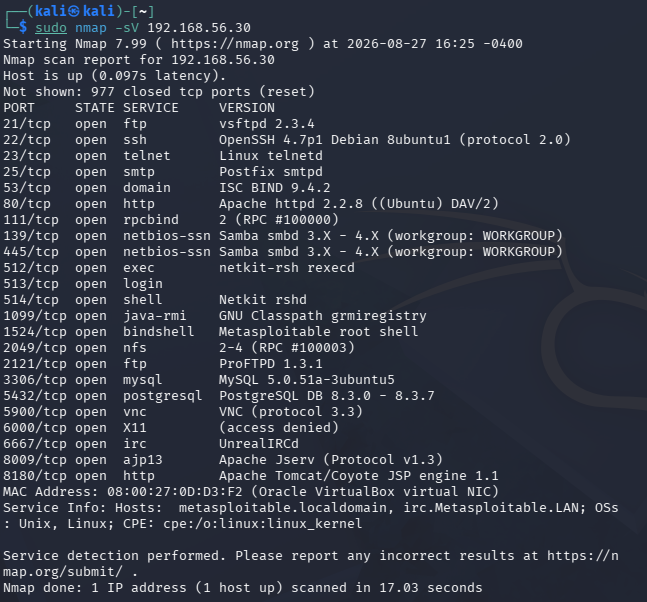
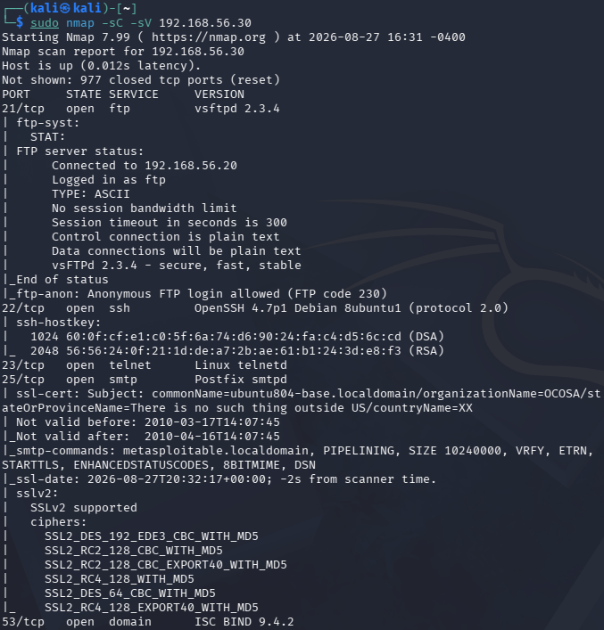
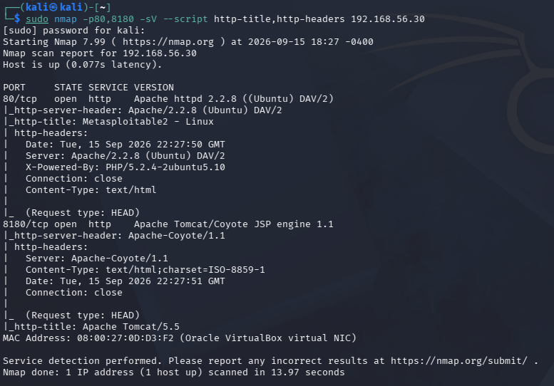
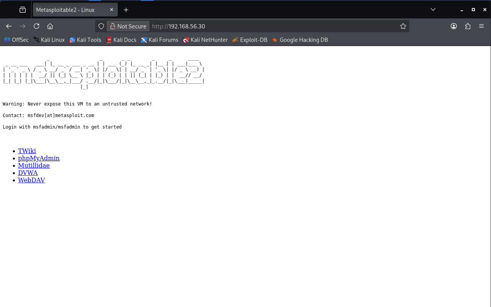
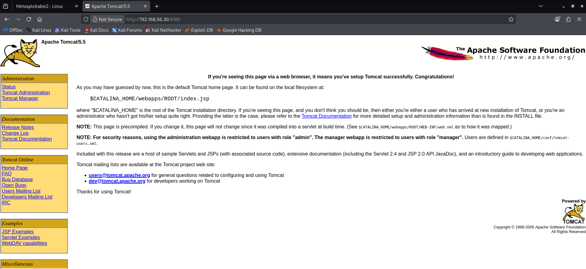

# Reconnaissance Commands

## Host Discovery

Comando utilizado:

`sudo nmap -sn 192.168.56.0/24`

Hosts identificados:

- `192.168.56.1`
- `192.168.56.10`
- `192.168.56.20`
- `192.168.56.30`
- `192.168.56.50`

Utilizei o Wireshark na interface `eth1` para analisar o tráfego ARP gerado durante o host discovery.

## TCP SYN Scan

Comando utilizado:

`sudo nmap -sS 192.168.56.1 192.168.56.10 192.168.56.30 192.168.56.50`

O scan mostrou que o host `192.168.56.30` tinha significativamente mais serviços expostos do que os restantes hosts. Por esse motivo, selecionei-o para uma enumeração mais detalhada.

## Service and Version Detection

Comando utilizado:

`sudo nmap -sV 192.168.56.30`

Principais serviços identificados:

- FTP — `vsftpd 2.3.4`
- SSH — `OpenSSH 4.7p1`
- Telnet
- HTTP — `Apache 2.2.8`
- SMB — `Samba 3.0.20`
- NFS
- MySQL
- PostgreSQL
- VNC
- IRC — `UnrealIRCd`
- Tomcat — `5.5`
- Bind shell — porta `1524`

## Detailed Enumeration

Comando utilizado:

`sudo nmap -sC -sV 192.168.56.30`

O scan detalhado revelou informações adicionais, como:

- Anonymous FTP login ativo
- SMB signing desativado
- Suporte a SSLv2 no serviço SMTP
- Vários serviços legacy expostos
- Metasploitable root shell disponível na porta `1524`
- Apache Tomcat disponível na porta `8180`
- UnrealIRCd disponível na porta `6667`

Os resultados confirmaram que o host `192.168.56.30` apresentava a maior attack surface do laboratório, sendo selecionado como alvo principal para a fase de exploitation.

## SMB Enumeration

Realizei a enumeração do serviço SMB nas portas `139` e `445`.

Comando utilizado:

`sudo nmap -p139,445 --script smb-protocols,smb-security-mode,smb-enum-shares,smb-enum-users 192.168.56.30`

O scan identificou várias configurações relevantes para a segurança:

- SMBv1 está ativo
- SMB message signing está desativado
- É possível enumerar vários utilizadores locais
- Anonymous/guest access está ativo
- O Nmap identificou a share `tmp` como permitindo acesso anónimo `READ/WRITE`

### Manual SMB Validation

Validei manualmente o anonymous SMB access com o comando:

`smbclient -N -L //192.168.56.30`

O servidor permitiu anonymous login e revelou as seguintes shares:

- `print$`
- `tmp`
- `opt`
- `IPC$`
- `ADMIN$`

De seguida, acedi à share `tmp` sem utilizar uma password:

`smbclient -N //192.168.56.30/tmp`

Para listar o conteúdo da share, utilizei:

`ls`

Consegui aceder à share e realizar um directory listing através de uma sessão anónima.

A permissão de escrita `WRITE`, identificada pelo Nmap, não foi confirmada manualmente neste teste.

## HTTP/Web Enumeration

Identifiquei serviços Web nas portas `80/TCP` e `8180/TCP`.

Para realizar o service and version detection inicial, utilizei:

`sudo nmap -p80,8180 -sV --script http-title,http-headers 192.168.56.30`

O scan identificou:

- Porta `80/TCP` — Apache HTTP Server `2.2.8`
- PHP `5.2.4-2ubuntu5.10`
- Porta `8180/TCP` — Apache Tomcat `5.5`
- Os endpoints testados utilizam HTTP sem HTTPS

### Manual Web Inspection

Inspecionei manualmente o serviço Web da porta `80` através do browser:

`http://192.168.56.30`

A página principal do Metasploitable2 apresentava várias aplicações e serviços expostos:

- TWiki
- phpMyAdmin
- Mutillidae
- DVWA
- WebDAV

A página também apresentava as default credentials do Metasploitable2: `msfadmin/msfadmin`.

De seguida, inspecionei o serviço Tomcat através do endereço:

`http://192.168.56.30:8180`

A default page do Apache Tomcat `5.5` estava acessível e apresentava links para recursos administrativos e exemplos, incluindo:

- Tomcat Administration
- Tomcat Manager
- JSP Examples
- Servlet Examples
- WebDAV capabilities

O acesso às interfaces administrativas não foi testado nesta fase de reconnaissance.

### HTTP Path Enumeration

Realizei uma enumeração adicional dos caminhos Web utilizando o script `http-enum` do Nmap.

Comando utilizado:

`sudo nmap -p80,8180 --script http-enum 192.168.56.30`

O scan identificou vários recursos potencialmente interessantes na porta `80`:

- `/tikiwiki/`
- `/test/`
- `/phpinfo.php`
- `/phpMyAdmin/`
- `/doc/`
- `/icons/`
- `/index/`

### PHP Information Disclosure Validation

Depois de identificar o ficheiro `/phpinfo.php`, acedi manualmente à página através do browser:

`http://192.168.56.30/phpinfo.php`

A página estava acessível sem autenticação e expunha informações detalhadas sobre o ambiente PHP e o servidor, incluindo:

- PHP version
- Operating system e kernel information
- Server API
- PHP configuration paths
- Loaded configuration file
- PHP modules e features disponíveis

Esta informação pode ajudar um atacante a identificar as versões e configurações utilizadas pelo servidor, facilitando uma reconnaissance mais direcionada.

