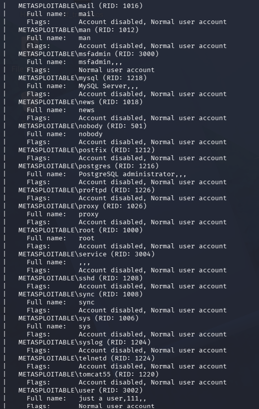
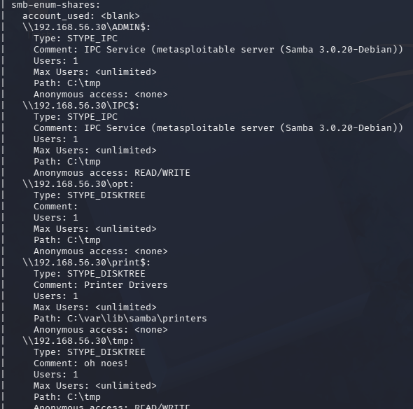
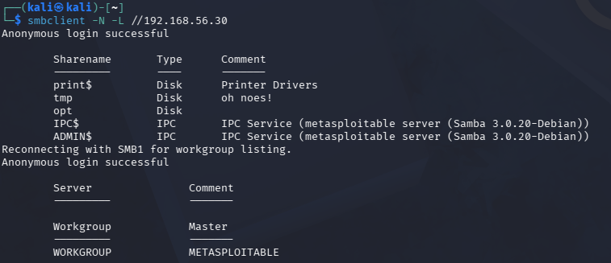
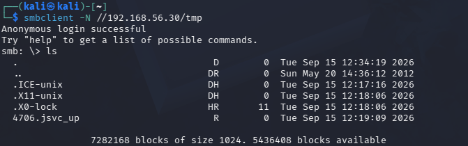
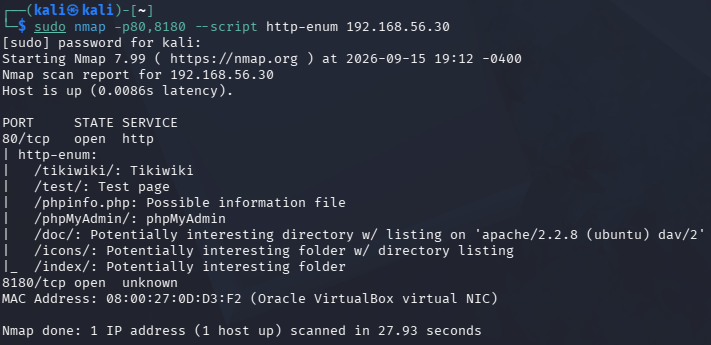
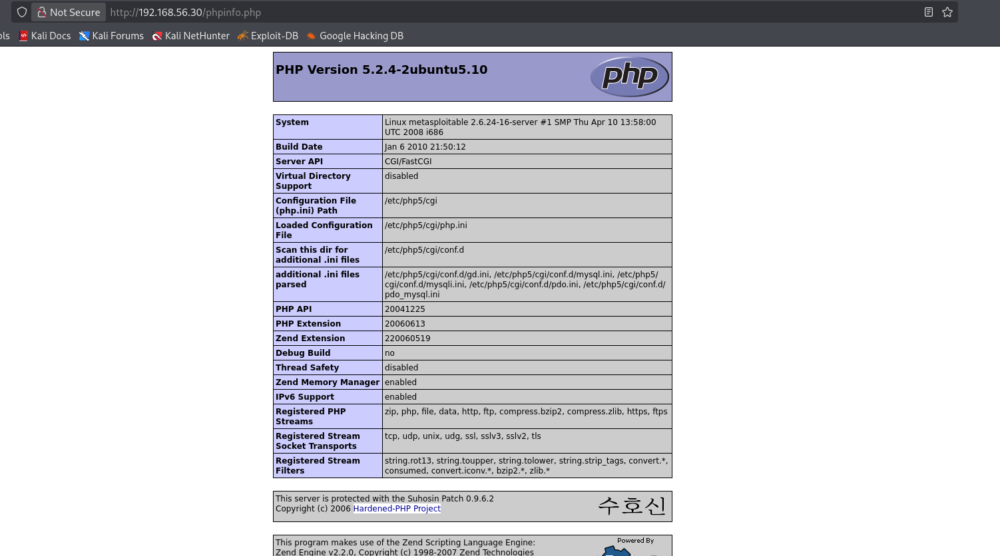

# Reconnaissance Findings

## Finding 01 — Anonymous FTP Access

**Target:** `192.168.56.30`  
**Port:** `21/TCP`  
**Service:** `vsFTPd 2.3.4`  
**Severity:** Medium

### Description

The FTP service allows anonymous authentication without requiring a valid user account.

This was identified using Nmap and manually validated by connecting to the FTP server using the `anonymous` account.

The server returned:

`230 Login successful.`

A directory listing was performed using:

`ls -la`

No files were exposed in the accessible directory during the assessment.

Additionally, the FTP connection operates in plain text, meaning that authentication data and transferred information are not encrypted.

### Impact

Anonymous FTP access increases the attack surface by allowing unauthenticated users to interact with the FTP service.

Although no files were exposed during this assessment, an insecure configuration could potentially lead to:

- Unauthorized access to files
- Information disclosure
- Unauthorized file upload or modification if write permissions are enabled
- Interception of FTP credentials and transferred data

### Evidence

### Recommendation

- Disable anonymous FTP access unless explicitly required.
- Restrict FTP access to authorized users.
- Replace FTP with SFTP or FTPS.
- Review FTP directory permissions.
- Keep the FTP service updated or remove it if it is not required.

### Status

**Confirmed**
## Finding 02 — Insecure SMB Configuration and Anonymous Access

**Target:** `192.168.56.30`  
**Ports:** `139/TCP`, `445/TCP`  
**Service:** `Samba 3.0.20-Debian`  
**Severity:** High

### Description

The SMB service exposes several insecure configurations.

Enumeration identified that SMBv1 is enabled and SMB message signing is disabled.

The service also allows anonymous/guest authentication and permits unauthenticated enumeration of SMB shares and local user accounts.

The `tmp` share was reported by Nmap as allowing anonymous `READ/WRITE` access.

Manual validation confirmed that an anonymous user could successfully authenticate to the SMB service, enumerate available shares, access the `tmp` share, and list its contents.

### Impact

These SMB misconfigurations increase the attack surface of the system and may allow an unauthenticated attacker to gather information or interact with exposed resources.

Potential impacts include:

- Enumeration of valid usernames
- Enumeration of SMB shares
- Unauthorized access to shared resources
- Exposure of files stored in anonymously accessible shares
- Increased risk associated with the use of the legacy SMBv1 protocol
- Increased exposure to relay or man-in-the-middle attacks when SMB signing is disabled

### Evidence

### Recommendation

- Disable SMBv1 and use modern SMB versions.
- Enable SMB message signing where appropriate.
- Disable anonymous and guest SMB access.
- Restrict access to SMB shares using proper authentication and permissions.
- Remove unnecessary SMB shares.
- Limit SMB access to trusted hosts and network segments.
- Keep Samba updated to a supported version.

### Status
## Finding 03 — Exposed PHP Information Page

**Target:** `192.168.56.30`  
**Port:** `80/TCP`  
**Service:** Apache HTTP Server / PHP  
**Severity:** Low

### Description

A publicly accessible PHP information page was identified at:

`http://192.168.56.30/phpinfo.php`

The page exposes detailed information about the server's PHP configuration and underlying system.

The exposed information includes:

- PHP version `5.2.4-2ubuntu5.10`
- Operating system and kernel information
- Server API configuration
- PHP configuration file locations
- Loaded `php.ini` path
- Enabled PHP extensions and modules
- Internal filesystem paths

This information was initially identified using Nmap HTTP enumeration and was then manually validated through the web browser.

### Impact

The exposed `phpinfo()` page provides an unauthenticated user with detailed technical information about the server environment.

Although this does not directly provide access to the system, the information can assist an attacker during reconnaissance by helping identify:

- Software versions
- Server configuration
- Installed PHP components
- Internal filesystem paths
- Potentially vulnerable technologies

This information can make subsequent attacks more targeted and efficient.

### Evidence

### Recommendation

- Remove publicly accessible `phpinfo()` pages from production systems.
- Restrict diagnostic and development pages to authorized administrators.
- Avoid exposing unnecessary information about software versions and server configuration.
- Review the web root for other development, test, or diagnostic files.
- Keep PHP and the web server updated to supported versions.

### Status

**Confirmed**
**Confirmed**
