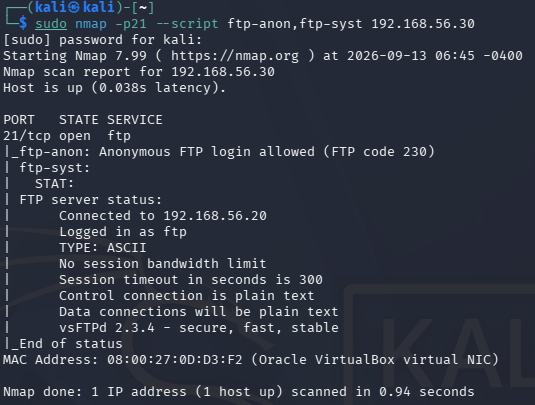
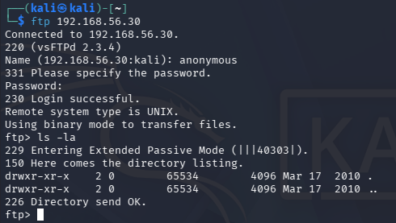

# Reconnaissance Findings

## Finding 01 — Anonymous FTP Access

**Target:** `192.168.56.30`  
**Port:** `21/TCP`  
**Service:** `vsFTPd 2.3.4`  
**Severity:** Medium

### Description

The FTP service allows anonymous authentication without requiring a valid user account.

This was identified using Nmap and manually validated by connecting to the FTP server using the `anonymous` account.

The server returned:

`230 Login successful.`

A directory listing was performed using:

`ls -la`

No files were exposed in the accessible directory during the assessment.

Additionally, the FTP connection operates in plain text, meaning that authentication data and transferred information are not encrypted.

### Impact

Anonymous FTP access increases the attack surface by allowing unauthenticated users to interact with the FTP service.

Although no files were exposed during this assessment, an insecure configuration could potentially lead to:

- Unauthorized access to files
- Information disclosure
- Unauthorized file upload or modification if write permissions are enabled
- Interception of FTP credentials and transferred data

### Evidence

### Recommendation

- Disable anonymous FTP access unless explicitly required.
- Restrict FTP access to authorized users.
- Replace FTP with SFTP or FTPS.
- Review FTP directory permissions.
- Keep the FTP service updated or remove it if it is not required.

### Status

**Confirmed**
