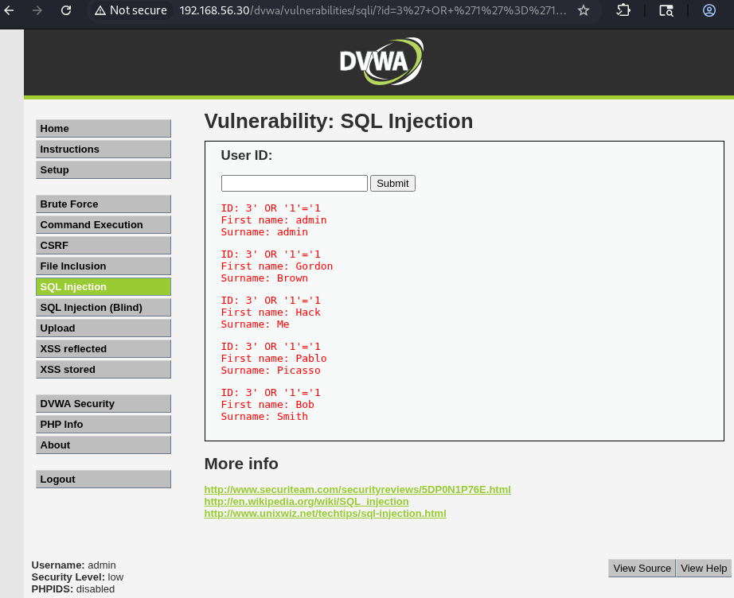
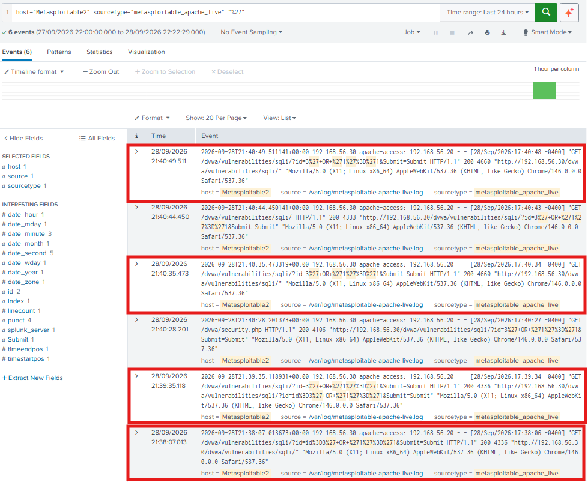

# Scenario 02 — Incident Response: DVWA SQL Injection

## 1. Resumo do Incidente

Foi detetado um pedido HTTP com um payload de SQL Injection contra a aplicação DVWA (Security Level: Low) alojada no Metasploitable2 (`192.168.56.30`), com origem no host `192.168.56.20`. O pedido foi bem-sucedido: a aplicação devolveu 5 registos de utilizadores, em vez de apenas o utilizador associado ao `id` submetido.

O padrão observado é consistente com a exploração de uma vulnerabilidade de SQL Injection no parâmetro `id`.

---

## 2. Cronologia (Timeline)

| Hora | Evento |
|------|--------|
| 28/Sep/2026 17:40:34 (-0400) | Pedido `GET /dvwa/vulnerabilities/sqli/` com `id=3%27+OR+%271%27%3D%271` a partir de `192.168.56.20`; resposta `HTTP 200` com 4660 bytes (resposta normal: 4387 bytes) |
| — | Pedido registado no Apache `access.log` e indexado no Splunk (`metasploitable_apache_live`), onde a pesquisa por `%27` devolveu 6 eventos |

---

## 3. Sistemas e Contas Afetados

- **Sistema alvo:** Metasploitable2 — `192.168.56.30`
- **Serviço:** HTTP — Apache + DVWA (módulo SQL Injection)
- **Parâmetro vulnerável:** `id`
- **Origem do ataque:** `192.168.56.20`
- **Dados expostos:** nome e apelido dos 5 registos de utilizadores apresentados (`admin`, `Gordon Brown`, `Hack Me`, `Pablo Picasso`, `Bob Smith`)

---

## 4. Evidências

- **Aplicação:** o payload `3' OR '1'='1` devolveu 5 utilizadores em vez de 1



- **Apache access.log:** pedido com o payload codificado em URL e resposta de 4660 bytes (contra 4387 bytes numa resposta normal)

```text
192.168.56.20 - - [28/Sep/2026:17:40:34 -0400] "GET /dvwa/vulnerabilities/sqli/?id=3%27+OR+%271%27%3D%271&Submit=Submit HTTP/1.1" 200 4660
```

- **Splunk:** pesquisa sobre o sourcetype `metasploitable_apache_live` (6 eventos devolvidos)

```spl
host="Metasploitable2" sourcetype="metasploitable_apache_live" "%27"
```



Fluxo da evidência:

```text
  Aplicação (5 utilizadores devolvidos)
              │
              ▼
  Apache access.log (200, 4660 bytes vs 4387 bytes)
              │
              ▼
  Splunk (metasploitable_apache_live → pesquisa por "%27")
```

Evidências documentadas em `03-exploitation/dvwa-sql-injection.md` e `04-detection/dvwa-sql-injection-detection.md`.

---

## 5. Impacto

A evidência observada mostra que input controlado pelo utilizador influenciou a consulta SQL executada pela aplicação, levando à exposição de 5 registos de utilizadores a partir de `192.168.56.20`.

Neste cenário foram apresentados apenas o nome e o apelido dos utilizadores. Num ambiente real, uma vulnerabilidade deste tipo poderia resultar em acesso não autorizado a outras informações armazenadas na base de dados, dependendo da construção das queries e das permissões atribuídas à conta da aplicação. Não foram testadas técnicas adicionais (como UNION-based injection).

---

## 6. Contenção (Ações Recomendadas)

As seguintes ações de contenção seriam aplicáveis a este tipo de incidente. Não foram executadas neste laboratório e são listadas como resposta recomendada:

- Bloquear o IP de origem (`192.168.56.20`) ao nível da firewall
- Bloquear, num WAF ou proxy inverso, pedidos com padrões de SQL Injection (aspa simples codificada `%27` combinada com operadores como `OR`/`UNION`)
- Restringir temporariamente o acesso à aplicação vulnerável
- Rever os logs do Apache e do Splunk para identificar outros pedidos com o mesmo padrão

---

## 7. Remediação (Ações Recomendadas)

- Utilizar prepared statements / queries parametrizadas em vez de concatenar input do utilizador nas queries SQL
- Validar e sanitizar o input do utilizador (tipo, formato e comprimento esperados)
- Aplicar o princípio do menor privilégio à conta de base de dados usada pela aplicação
- Não expor mensagens de erro detalhadas ao cliente
- Colocar um WAF à frente da aplicação como camada adicional de proteção
- Manter a aplicação e o servidor web atualizados e com configuração segura (o DVWA em nível Low é vulnerável por design)

---

## 8. Lições Aprendidas

A análise conjunta de três pontos de evidência (resposta da aplicação, Apache `access.log` e Splunk) permitiu confirmar a exploração com maior confiança. O tamanho da resposta (4660 bytes contra 4387 bytes) mostrou-se um indicador útil para distinguir um pedido normal de um pedido que devolveu múltiplos registos.

Ao contrário do cenário SSH, esta deteção baseou-se num padrão no próprio pedido HTTP (a aspa simples codificada `%27`) e não num threshold de contagem. Num ambiente de produção, uma pesquisa tão simples geraria falsos positivos e deveria ser refinada, por exemplo limitando-se a parâmetros específicos da aplicação ou complementando-se com um WAF.
