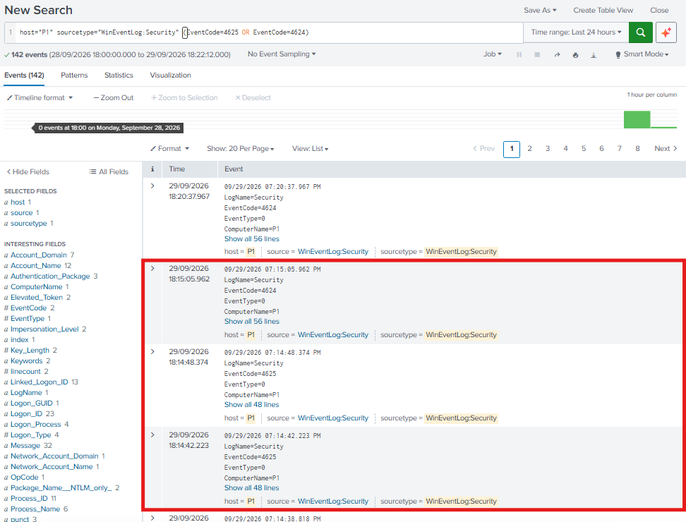
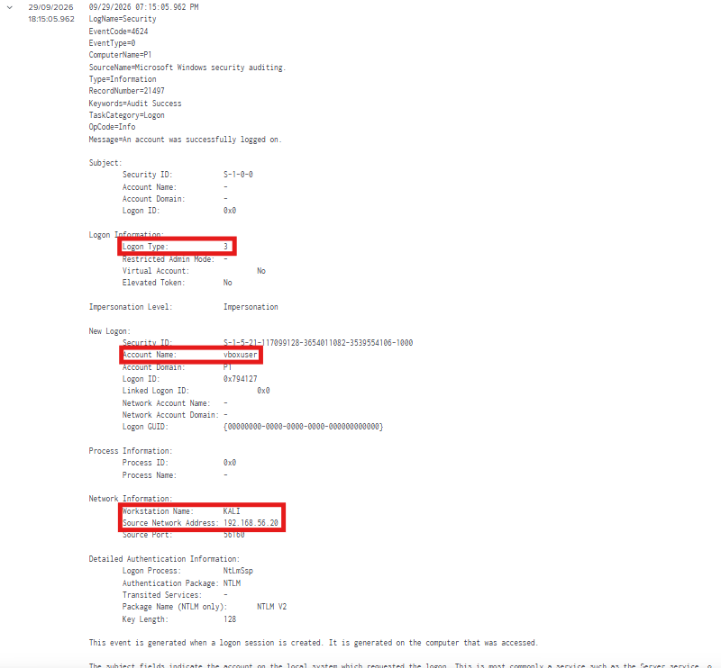

# Scenario 03 — Incident Response: SMB Authentication Attack

## 1. Resumo do Incidente

Foram detetados dois eventos de falha de autenticação (`4625`) seguidos de um evento de autenticação bem-sucedida (`4624`) no Windows 10 (`192.168.56.50`, hostname `P1`), com origem no host `192.168.56.20`, através do serviço SMB. A autenticação bem-sucedida foi realizada com a conta `vboxuser`.

O padrão observado é consistente com tentativas de autenticação remota contra o serviço SMB.

---

## 2. Cronologia (Timeline)

| Hora | Evento |
|------|--------|
| 18:14:42 | Evento `4625` (Failed Logon) a partir de `192.168.56.20` |
| 18:14:48 | Evento `4625` (Failed Logon) a partir de `192.168.56.20` |
| 18:15:05 | Evento `4624` (Successful Logon) para a conta `vboxuser`, `Logon Type: 3` (Network), a partir de `192.168.56.20` |

---

## 3. Sistemas e Contas Afetados

- **Sistema alvo:** Windows 10 — `192.168.56.50` (hostname `P1`)
- **Serviço:** SMB — `445/TCP`
- **Conta envolvida:** `vboxuser`
- **Origem do ataque:** `192.168.56.20` (workstation `KALI`)
- **Protocolo de autenticação:** NTLM

---

## 4. Evidências

- **Eventos de autenticação:** pesquisa dos eventos `4625` e `4624` no host Windows, sourcetype `WinEventLog:Security`

```spl
host="P1" sourcetype="WinEventLog:Security" (EventCode=4625 OR EventCode=4624)
```

Resultado: entre a atividade normal do sistema, três eventos correspondem às tentativas realizadas a partir do Kali (`18:14:42` — `4625`, `18:14:48` — `4625`, `18:15:05` — `4624`).



- **Investigação do login bem-sucedido:** pesquisa do evento `4624` associado à conta `vboxuser`

```spl
host="P1" sourcetype="WinEventLog:Security" EventCode=4624 Account_Name="vboxuser"
```

Campos confirmados no evento das `18:15:05`:

```text
Logon Type:             3 (Network)
Account Name:           vboxuser
Workstation Name:       KALI
Source Network Address: 192.168.56.20
Authentication Package: NTLM
```



Fluxo da evidência:

```text
  2 eventos 4625 (192.168.56.20, 18:14:42 e 18:14:48)
              │
              ▼
  1 evento 4624 (vboxuser, Logon Type 3, NTLM, 18:15:05)
```

Evidências documentadas em `04-detection/smb-auth-detection.md`.

---

## 5. Impacto

A evidência observada mostra que, após duas falhas de autenticação, ocorreu uma autenticação SMB bem-sucedida com a conta `vboxuser` a partir de `192.168.56.20`, através da rede e com NTLM.

Durante o teste foi confirmada a autenticação e a enumeração das partilhas disponíveis (`ADMIN$`, `C$`, `IPC$`), mas não foi verificado o acesso ao conteúdo das partilhas. Também não foi testado se existe account lockout ou rate limiting, dado o número reduzido de tentativas.

Num ambiente real, uma autenticação SMB bem-sucedida deste tipo poderia permitir acesso a partilhas de ficheiros e, dependendo dos privilégios da conta, acesso a recursos administrativos do sistema. O uso de NTLM está associado, em ambientes que dependem deste protocolo, a técnicas como pass-the-hash e NTLM relay; estas técnicas não foram executadas neste cenário e são referidas apenas como contexto.

---

## 6. Contenção (Ações Recomendadas)

As seguintes ações de contenção seriam aplicáveis a este tipo de incidente. Não foram executadas neste laboratório e são listadas como resposta recomendada:

- Bloquear o IP de origem (`192.168.56.20`) ao nível da firewall
- Desativar temporariamente a conta envolvida (`vboxuser`) ou repor a sua password
- Terminar as sessões SMB ativas provenientes da origem suspeita
- Rever os eventos `4624` e `4625` do host para identificar outras autenticações a partir da mesma origem

---

## 7. Remediação (Ações Recomendadas)

- Impor passwords fortes em todas as contas locais com acesso remoto
- Implementar uma account lockout policy após múltiplas falhas de autenticação
- Restringir o acesso à porta `445/TCP` por firewall, permitindo apenas origens necessárias
- Desativar File and Printer Sharing e Network Discovery nos sistemas onde não sejam necessários
- Restringir ou desativar o uso de NTLM, preferindo Kerberos, e ativar SMB signing
- Monitorizar eventos `4625` por IP de origem num intervalo de tempo

---

## 8. Lições Aprendidas

Os Windows Security Event Logs permitiram identificar o padrão de falhas seguidas de um login bem-sucedido. O campo `Logon Type: 3` mostrou-se útil para isolar autenticações vindas da rede da restante atividade local do sistema, e os campos `Workstation Name` e `Source Network Address` permitiram atribuir a autenticação ao host de origem.

Neste cenário a identificação foi feita por pesquisa manual dos eventos `4625` e `4624`, dado o número reduzido de tentativas. Num ambiente de produção, uma detection query eficaz basear-se-ia na contagem de eventos `4625` por IP de origem num intervalo de tempo, de forma semelhante à deteção utilizada no cenário SSH, permitindo identificar padrões de password spraying ou brute-force contra o serviço SMB.
