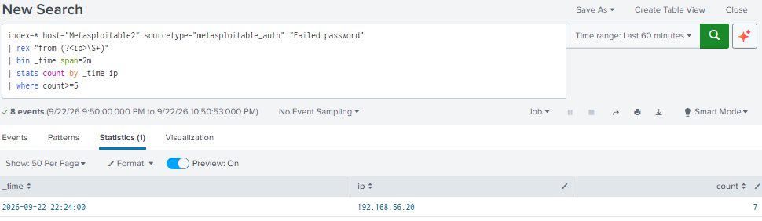
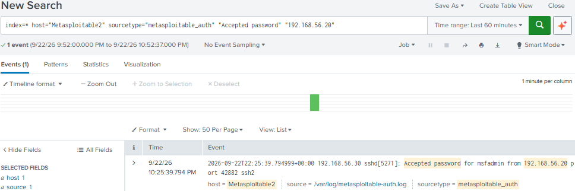

# Scenario 01 — Incident Response: SSH Dictionary Attack

## 1. Resumo do Incidente

Foi detetada uma série de eventos `Failed password` no serviço SSH do Metasploitable2 (`192.168.56.30`), com origem no host `192.168.56.20`, seguida de um evento `Accepted password` para a conta `msfadmin` a partir da mesma origem.

O padrão observado é consistente com um dictionary attack contra o serviço SSH.

---

## 2. Cronologia (Timeline)

| Hora | Evento |
|------|--------|
| Janela de 2 min iniciada às 22:24 | 7 eventos `Failed password` a partir de `192.168.56.20`, identificados pela detection query no Splunk |
| 22:25:39 | Evento `Accepted password` para a conta `msfadmin` a partir de `192.168.56.20` |

---

## 3. Sistemas e Contas Afetados

- **Sistema alvo:** Metasploitable2 — `192.168.56.30`
- **Serviço:** SSH — `22/TCP`
- **Conta envolvida:** `msfadmin`
- **Origem do ataque:** `192.168.56.20`

---

## 4. Evidências

- **Falhas de autenticação:** detection query sobre o sourcetype `metasploitable_auth` (5 ou mais eventos `Failed password` por IP num intervalo de 2 minutos)

```spl
index=* host="Metasploitable2" sourcetype="metasploitable_auth" "Failed password"
| rex field=_raw "from (?<src_ip>\d{1,3}(?:\.\d{1,3}){3})"
| bin _time span=2m
| stats count AS failed_attempts BY _time src_ip
| where failed_attempts >= 5
| sort - _time
```

Resultado: 7 eventos `Failed password` provenientes de `192.168.56.20` no intervalo de 2 minutos iniciado às 22:24.



- **Autenticação bem-sucedida:** pesquisa dos eventos `Accepted password` a partir do IP identificado

```spl
index=* host="Metasploitable2" sourcetype="metasploitable_auth" "Accepted password" "192.168.56.20"
```

Resultado: um evento `Accepted password` para o utilizador `msfadmin`, com origem em `192.168.56.20`, às 22:25:39.



Fluxo da evidência:

```text
  7 eventos "Failed password" (192.168.56.20, janela de 2 min iniciada às 22:24)
              │
              ▼
  1 evento "Accepted password" (msfadmin, 192.168.56.20, 22:25:39)
```

Evidências documentadas em `04-detection/ssh-detection.md`.

---

## 5. Impacto

A evidência observada mostra que, após múltiplas falhas de autenticação, ocorreu uma autenticação SSH bem-sucedida com a conta `msfadmin` a partir de `192.168.56.20`.

Neste cenário não foi analisada a atividade realizada durante a sessão. Num ambiente real, uma autenticação bem-sucedida deste tipo poderia permitir acesso remoto ao sistema e execução de comandos e, dependendo dos privilégios da conta, movimentação lateral ou escalada de privilégios.

---

## 6. Contenção (Ações Recomendadas)

As seguintes ações de contenção seriam aplicáveis a este tipo de incidente. Não foram executadas neste laboratório e são listadas como resposta recomendada:

- Bloquear o IP de origem (`192.168.56.20`) ao nível da firewall
- Desativar temporariamente a conta envolvida (`msfadmin`)
- Terminar sessões SSH ativas provenientes da origem suspeita

---

## 7. Remediação (Ações Recomendadas)

- Impor uma política de passwords fortes
- Implementar uma account lockout policy após múltiplas falhas de autenticação
- Restringir o acesso SSH por IP (allowlist) ou através de VPN
- Preferir autenticação por chave em vez de password
- Considerar a utilização de ferramentas como o fail2ban para bloquear automaticamente IPs com múltiplas falhas

---

## 8. Lições Aprendidas

A monitorização centralizada dos logs de autenticação permitiu identificar o padrão de múltiplas falhas seguidas de uma autenticação bem-sucedida.

Uma detection query baseada na contagem de falhas por IP num intervalo de tempo mostrou-se eficaz para identificar este tipo de atividade, sem ser necessário conhecer antecipadamente o IP do atacante. O número de eventos `Failed password` no Splunk (7) não corresponde ao número de verificações reportadas pelo Medusa (26), pelo que a contagem de eventos não deve ser interpretada como o número de passwords testadas.

Num ambiente de produção, o threshold utilizado (5 falhas em 2 minutos) deveria ser ajustado ao comportamento normal dos utilizadores para reduzir falsos positivos.
