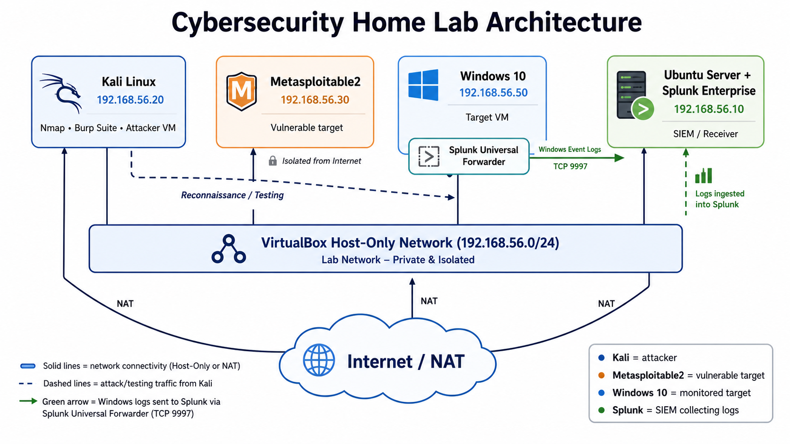

# Cybersecurity Home Lab — Purple Team Approach

## Overview

A virtual lab environment simulating real-world cyberattacks, followed by
detection, analysis, and incident response — combining offensive (Red Team)
and defensive (Blue Team) perspectives. Attacks are simulated, detected via
SIEM monitoring, and classified using the ATT&CK framework (MITRE).

## Objective

Demonstrate practical skills in both attack simulation and threat detection,
replicating the workflow of a SOC Analyst and Penetration Tester.

## Lab Architecture

* **Kali Linux — 192.168.56.20** — attacker machine
* **Metasploitable2 — 192.168.56.30** — primary vulnerable target
* **Windows 10 — 192.168.56.50** — monitored target
* **Ubuntu Server + Splunk Enterprise — 192.168.56.10** — SIEM and log receiver
* **Splunk Universal Forwarder** — forwards Windows Event Logs to Splunk via TCP 9997

## Tools

`VirtualBox` `Kali Linux` `Nmap` `Metasploit` `Burp Suite` `Wireshark` `Splunk Enterprise` `Splunk Universal Forwarder`

## Project Structure

01-setup/ → lab configuration and network setup

02-reconnaissance/ → scanning and enumeration

03-exploitation/ → attack simulation

04-detection/ → SIEM dashboards, logs, packet captures

05-incident-response/ → response documentation

mitre-attack-mapping.md → techniques used, mapped to ATT&CK

final-report.pdf → full write-up

## Methodology

Each attack simulated in this lab follows a consistent cycle:

1. **Reconnaissance** — identify targets and services
2. **Exploitation** — simulate the attack
3. **Detection** — verify visibility through SIEM, logs, and packet capture
4. **Classification** — map the technique used to the ATT&CK framework
5. **Response** — document the appropriate containment and remediation steps

## Status

In progress — documentation updated as the project develops.

## Author

Rhuan — Cybersecurity student (CTeSP), Lisbon 
GitHub: [github.com/rhuan001](https://github.com/rhuan001) 
LinkedIn: [Rhuan Santos](https://www.linkedin.com/in/rhuan-santos-728514302/)
