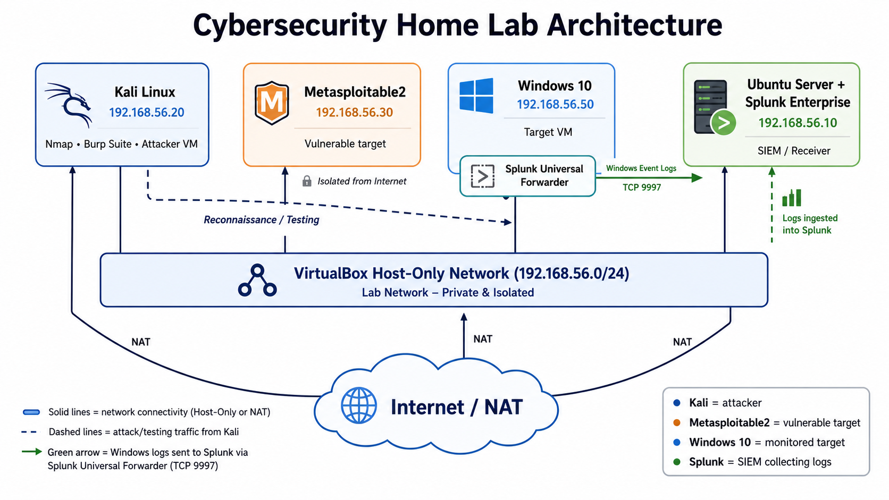

# Cybersecurity Home Lab — Purple Team Approach

> Hands-on cybersecurity lab combining attack simulation, SIEM detection, incident response and MITRE ATT&CK mapping.

## Overview

This project is a home lab designed to simulate the workflow of a Purple Team. It combines offensive attack simulation with defensive monitoring and incident response:

**Reconnaissance → Exploitation → Detection → Classification → Incident Response**

Three realistic attack scenarios were simulated against intentionally vulnerable systems in an isolated lab:

* SSH dictionary attack
* SQL Injection against DVWA
* SMB authentication against Windows 10

Each scenario was investigated using logs collected in **Splunk**, documented with supporting evidence, and mapped to **MITRE ATT&CK** where applicable.

## Objective

Demonstrate practical skills across offensive and defensive activities, following a simplified workflow similar to the one used by **SOC Analysts, Incident Responders and Penetration Testers**.

## Skills Demonstrated

* Network reconnaissance and service enumeration
* Authentication attack simulation
* Web application security testing and HTTP traffic interception
* Linux and Windows log analysis
* SIEM investigation in Splunk (SPL searches)
* Detection engineering fundamentals
* Incident response documentation
* MITRE ATT&CK mapping
* Evidence collection and technical reporting

## Lab Architecture

* **Kali Linux — 192.168.56.20** — attacker machine
* **Metasploitable2 — 192.168.56.30** — primary vulnerable target (DVWA, Apache, SSH)
* **Windows 10 — 192.168.56.50** — monitored target
* **Ubuntu Server + Splunk Enterprise — 192.168.56.10** — SIEM and log receiver
* **Splunk Universal Forwarder** — forwards Windows Event Logs to Splunk via TCP 9997

The machines communicate through a VirtualBox Host-Only network (`192.168.56.0/24`). Metasploitable2 has no Internet access.



## Scenarios

| # | Scenario | Attack tool | ATT&CK techniques | Detection in Splunk | Write-ups |
|---|---|---|---|---|---|
| 1 | SSH Dictionary Attack against Metasploitable2 | Medusa | `T1110.001`, `T1078.003` | Count of `Failed password` per IP (5+ in 2 minutes): 7 events, followed by an `Accepted password` | [Exploitation](03-exploitation/ssh-dictionary-attack.md) · [Detection](04-detection/ssh-detection.md) · [Incident Response](05-incident-response/ssh-dictionary-attack-ir.md) |
| 2 | SQL Injection on DVWA | Burp Suite | `T1190` | Search for `%27` in Apache logs (6 events), exploitation identified by response size | [Exploitation](03-exploitation/dvwa-sql-injection.md) · [Detection](04-detection/dvwa-sql-injection-detection.md) · [Incident Response](05-incident-response/dvwa-sql-injection-ir.md) |
| 3 | SMB Authentication against Windows 10 | `smbclient` | `T1078.003`, `T1135` | Windows Security events `4625` (failed logon) and `4624` (successful network logon, `Logon Type 3`, NTLM) | [Exploitation](03-exploitation/smb-auth-attack.md) · [Detection](04-detection/smb-auth-detection.md) · [Incident Response](05-incident-response/smb-auth-attack-ir.md) |

The full technique list, including reconnaissance, is in [`mitre-attack-mapping.md`](mitre-attack-mapping.md).

## Tools & Technologies

**Virtualization**
* VirtualBox

**Offensive Security**
* Kali Linux
* Nmap
* Medusa
* Burp Suite
* smbclient

**Network Analysis**
* Wireshark

**Defensive / SIEM**
* Splunk Enterprise
* Splunk Universal Forwarder
* Ubuntu Server (Splunk host)

**Target Systems**
* Metasploitable2
* DVWA
* Windows 10

## Project Structure

```text
01-setup/               → lab configuration, network setup and log ingestion
02-reconnaissance/      → scanning and enumeration (commands and findings)
03-exploitation/        → attack simulations (SSH, DVWA, SMB)
04-detection/           → Splunk searches and log analysis for each scenario
05-incident-response/   → incident response write-ups for each scenario
mitre-attack-mapping.md → techniques used, mapped to ATT&CK
progress-log.md         → day-by-day log of the project
```

## Methodology

Each attack simulated in this lab follows a consistent cycle:

1. **Reconnaissance** — identify targets and services
2. **Exploitation** — simulate the attack
3. **Detection** — verify visibility through SIEM and logs
4. **Classification** — map the technique used to the ATT&CK framework
5. **Response** — document the appropriate containment and remediation steps

### Evidence-Based Documentation

Every document describes only what was actually executed or observed. Commands, Splunk queries, log entries and screenshots are included as evidence where applicable.

Containment and remediation actions are explicitly marked as recommendations and are not presented as actions performed in the lab.

## Key Takeaways

### 1. Log visibility comes first

Before simulating attacks, I built and validated the pipeline that brings the logs into Splunk:

* Syslog forwarding from Metasploitable2
* Apache logs through the `local6` facility
* Windows Security Event Logs through the Splunk Universal Forwarder

The troubleshooting is documented in [`01-setup/setup-notes.md`](01-setup/setup-notes.md).

### 2. Different attacks need different detection approaches

| Scenario | Detection approach |
|---|---|
| SSH | Threshold-based count of authentication failures |
| SQL Injection | Pattern search in web server logs |
| SMB | Field-based investigation of Windows logon events |

### 3. Detection requires context

A single event is rarely enough. The investigations combined source IP, timestamp, account, logon type, authentication package, HTTP request and response size.

### 4. Evidence across layers

The SQL Injection was confirmed in the application, in the Apache `access.log` and in Splunk.

### 5. Limitations are stated explicitly

Each write-up distinguishes what was executed, what was observed and what was not tested.

## Limitations

* The SQL Injection and SMB detections are manual searches. Only the SSH scenario has a count-based detection.
* There are no Splunk dashboards or alerts yet.
* Activity after a successful login was not analysed, and account lockout and rate limiting were not tested.
* The discovery techniques of the reconnaissance phase have no detection in Splunk.
* Some ATT&CK mappings are approximate and are marked as such in [`mitre-attack-mapping.md`](mitre-attack-mapping.md).
* The SSH wordlist included the known lab password as its last entry.

These limitations are future development areas, not completed capabilities.

## Future Improvements

* Create Splunk dashboards for authentication and web attack activity
* Convert the manual searches into reusable detection rules and alerts
* Add detection for the reconnaissance activity
* Investigate post-authentication activity
* Add further attack scenarios and expand ATT&CK coverage

## Status

**Current phase:** core lab scenarios completed

- [x] Lab setup
- [x] Log ingestion
- [x] Reconnaissance
- [x] SSH attack scenario
- [x] SQL Injection scenario
- [x] SMB authentication scenario
- [x] Splunk detection
- [x] Incident response documentation
- [x] MITRE ATT&CK mapping
- [ ] Splunk dashboards and alerts
- [ ] Additional scenarios

## Author

Rhuan — Cybersecurity student (CTeSP), Lisbon<br>
GitHub: [github.com/rhuan001](https://github.com/rhuan001)<br>
LinkedIn: [Rhuan Santos](https://www.linkedin.com/in/rhuan-santos-728514302/)
